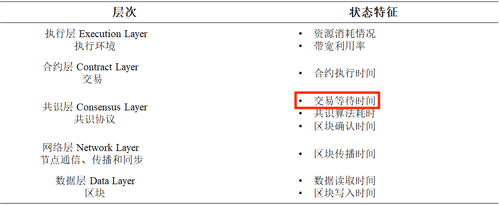

# go-ethereum-recorderfile使用方法

## 一、使用的以太坊版本

go-ethereum-1.11.0

## 二、启动以太坊

在源码中修改了global options，增加启动参数 --serverPort 默认值为9527（用作监听服务器端口）

```
# 只列出serverPort参数，其他参数照旧
geth --serverPort 9528
```

## 三、修改配置文件

1. recorderfile在go-ethereum-recorderfile/cmd目录下，使用方法与长安链一致
2. recorderfile/Makefile中serverPort需与geth启动时传入的serverPort一致（默认都是9527，多节点注意修改--serverPort参数）

## 四、记录测量指标

1. 使用以太坊Clique共识

2. 测量P2P网络平均传输时延 net_p2p_transmission_latency时需要修改源码中节点ID，本节点为A节点：

   1. p2p/peer.go/pingLoop() : p.rw.node.ID().String()的值修改为节点B的ID

   2. p2p/peer.go/handle() : case msg.Code == pingMsg中p.rw.node.ID().String()的值修改为节点A的ID

   3. p2p/peer.go/handle() : case msg.Code == pongMsg中p.rw.node.ID().String()的值修改为节点B的ID


# 性能参数测量指标图



> WHAT I've DONE
>
> * 交易等待时间
>
> 即交易排队时延tx_queue_delay
>
> * 交易吞吐量
>
> 即TPS
>
> * 区块确认时间